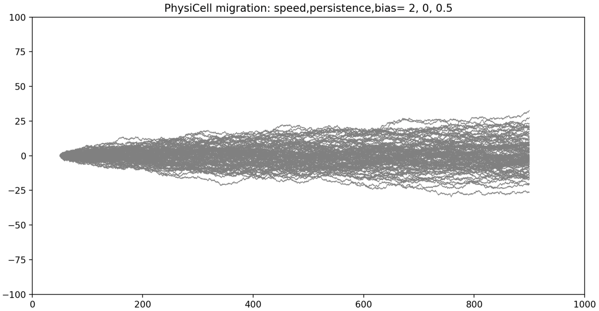

# OpenVT reference model: Persistent Random Walk using PhysiCell

```
$ make multiruns

# the config file has speed=2, persistence time=0:
$ grep speed p_motion_no_save.xml
        <speed units="micron/min">2</speed>
$ grep persist p_motion_no_save.xml
        <persistence_time units="min">0</persistence_time>

$ project_multiruns p_motion_no_save.xml 100 0.5   # 100 runs, migration bias=0.5
--> generates a 16M .csv file:  (saves output every mechanics dt= 0.1 sec)

$ more pc_combined_tracks.csv
Time,cellID,x,y
0.1,0,50,0
...
664.7,0,899.785,-5.05573
664.8,0,899.987,-5.19423
664.9,0,899.912,-4.86617
0.1,1,50,0
0.2,1,50.227,0.0697343
0.3,1,50.3665,0.249934
0.4,1,50.3838,0.473551
...

$ zip pc_combined_tracks.zip pc_combined_tracks.csv

$ python plot_pos.py 2 0 0.5
```


